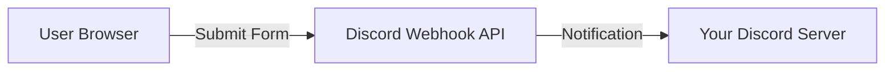

# 🧠 UX Audit & Backend Architecture Report

## 1. UX Features Suggestions (Non-Design)
Design is subjective, but **Experience** is objective. Based on my analysis of your code, here are the "Invisible" features that make a site feel premium:

### **A. Dynamic "Head" Metadata (SEO)**
- **Current State:** The tab title stays static (e.g., "Yasser Creatives").
- **The Fix:** When I go to `/contact`, the tab should say **"Contact Us | Yasser Creatives"**.
- **Why:** It helps users find the tab when they have 20 open, and it's crucial for Google ranking.

### **B. Custom 404 "Lost" Page**
- **Current State:** If I go to `/random-page`, it redirects to Home `(Route path="*"...)`.
- **The Fix:** Create a dedicated **404 Page**.
- **Why:** Redirecting confuses users ("Wait, I clicked a link, why am I back at the start?"). A 404 page ("Whoops, that page is gone") is honest and allows you to guide them back gracefully.

### **C. "Skip to Content" (Accessibility)**
- **The Fix:** An invisible link at the top that appears only when pressing `Tab`.
- **Why:** Power users and keyboard navigators hate tabbing through 10 menu links just to reach the main text. This is a hallmark of professional-grade sites.

### **D. PWA (Progressive Web App)**
- **The Fix:** Add a `manifest.json` and Service Worker.
- **Why:** This lets users "Install" your website on their phone/desktop like a native app. It also allows the site to work (or show a custom offline page) when their internet cuts out.

---

## 2. Where is your Backend?

**Short Answer:** You don't have one (and that's okay!).

### **Your Current Architecture: "Serverless"**
I analyzed `src/utils/discord.js` and `Contact.jsx`.
- **How it works:** Your frontend (React) talks **directly** to Discord via a Webhook.
- **The "Server":** Discord *is* your server. You are using their infrastructure to handle the data storage (in a channel) and notification.

### **Is this a problem?**
- **No.** For a portfolio or agency site, this is arguably **smarter** than building a backend.
    - **Cost:** $0.
    - **Maintenance:** Zero. No servers to crash.
    - **Speed:** Instant.
- **Reliability:** You already built a robust "fallback" system in `Contact.jsx` (IP Geolocation, validation) that runs on the client.

### **How to add a "Real" Backend?**
If you later decide you want to save emails to a database or send auto-replies:

1.  **Option A: Cloudflare Workers (Recommended)**
    - Since you use Cloudflare, you can write a small Javascript function (Worker) that sits between your site and the world.
    - *Best for:* Hiding your API keys and sending emails.

2.  **Option B: Supabase (firebase alternative)**
    - Gives you a full PostgreSQL database instantly.
    - *Best for:* If you want users to "Log In" or have User Profiles.

---

### **Summary**
You have a **Static Site** with **Serverless Integrations**. It is modern, fast, and secure. You do not strictly *need* a backend unless your requirements change (e.g., selling products or user logins).
